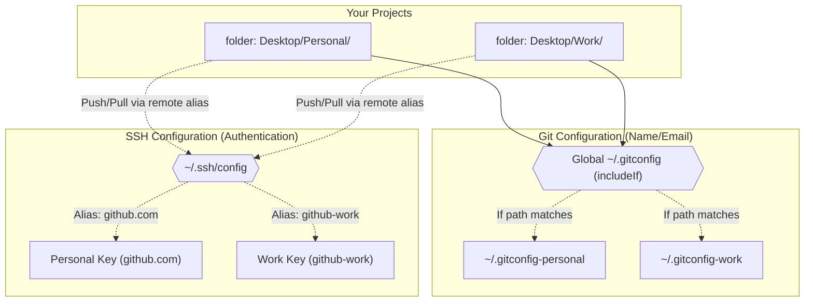

# github-pat
github-pat, how you can push your code and all without configuring multiple github on your system.

## Overview Architecture

Below is a visual representation of how the directory-based identity (via Git) and authentication (via SSH) interact to form a seamless workflow:

> [!TIP]
> **Infinite Expansion:** You are not limited to just "Work" and "Personal"! You can create infinitely multiple setups like this. If you get a new client or need a new proxy configuration, simply create a new directory (e.g., `Desktop/ClientX/`), add an `includeIf` block mapping it to `~/.gitconfig-clientx`, and create a new SSH host alias for it.
